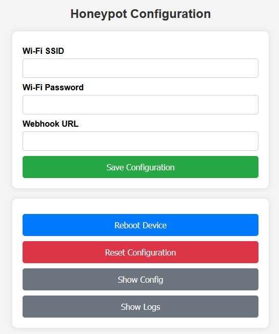

## ESP32 Honeypot with Web UI, SPIFFS Persistence and Webhook Alerts

This project is a standalone Telnet honeypot for the ESP32 platform. It emulates a realistic Linux shell environment to attract and analyze unauthorized access attempts. It features a full web-based configuration UI, persistent storage using SPIFFS, and webhook-based alerting that can be integrated with Discord, Telegram, Signal, WhatsApp, or SIEM platforms.

  
  Here the demo video on Evil-Cardputer:
  
  

Thanks to hosseios for the video ! 

---

Webui :  

Alerts on Discord :   

---

## ✅ Features

- Interactive Telnet honeypot server on port 23
- Realistic Linux shell simulation with multiple commands supported (pwd, whoami, cat, ls, cd, apt, etc.)
- Automatic logging of all client inputs with timestamp and IP address
- Webhooks for real-time alerts (Discord, Telegram, Signal, WhatsApp, SIEM, etc.)
- Web-based configuration panel (SSID, password, webhook)
- SPIFFS-based file system for persistent config and logs
- Offline mode with Wi-Fi Access Point for initial setup
- Fake file system structure with secrets to lure attackers
- Modular code, compatible with any ESP32 board (no M5Stack dependency)

---
## 🧩 Compatible Devices

Tested and confirmed working on:

- **M5Stack AtomS3**: [Buy here](https://s.click.aliexpress.com/e/_DnDXSKJ) or [Buy here](https://shop.m5stack.com/products/atoms3-dev-kit-w-0-85-inch-screen?ref=7h30th3r0n3)
- **M5Stack Atom Lite**: [Buy here](https://s.click.aliexpress.com/e/_Dm0e95D)
- **ESP32-C3** (with external antenna): [Buy here](https://s.click.aliexpress.com/e/_DD1yibp) (Be carefull to select sets WITH antenna)
- **Atom C6** (one of the smallest): [Buy here](https://shop.m5stack.com/products/m5stack-nanoc6-dev-kit?ref=7h30th3r0n3) 
- ✅ Any ESP32 Dev Board (e.g. DevKitC, NodeMCU-32S, Wemos D1 R32) [Buy here](https://s.click.aliexpress.com/e/_DEWPrnz)

---
## ⚙️ Installation

1. Flash this firmware on any ESP32 using Arduino IDE or PlatformIO
2. On first boot, ESP32 will create a Wi-Fi access point:
   - SSID: HoneypotConfig
   - Password: HoneyPotConfig123
3. Connect and open `http://192.168.4.1` to configure
4. After saving the configuration, the ESP32 will reboot and connect to your Wi-Fi
5. Telnet honeypot starts on port 23, listening for attackers
6. All captured inputs will be logged and optionally sent to your webhook

If the AP is not near it, mode configuration is enabled and web portal is accessible.

---

## 📁 SPIFFS Structure

/config.json       → Contains Wi-Fi and webhook settings  
/honeypot_logs.txt → Stores captured login attempts and commands  
/index.html        → Web-based configuration UI  

All files are automatically created at first boot if missing.

---

## 📡 Webhook Format

Example payload (JSON, sent as POST):

{
  "content": "📡 Honeypot\n🔍 IP: 192.168.1.5\n💻 Command: `cat /etc/passwd`"
}

You can route this to:

- Discord (via Webhook URL)
- Telegram (via Bot API Gateway)
- Signal (via relay server or bridge)
- WhatsApp (via Business API)
- SIEMs or custom log collectors

---

## 🧠 Emulated Commands

Basic commands:
- pwd, whoami, uptime, hostname, uname -a, id, lscpu, df -h, free -h, env, set, history

Filesystem:
- ls, ls -l, cd, cat, mkdir, rm, rmdir, touch, chmod, chown

Networking:
- ifconfig, ip addr, ping, netstat -an, curl, wget

Services:
- service <name> start/stop/status
- systemctl status/start/stop

Package manager:
- apt-get update, apt-get install

Privilege escalation:
- sudo (with denial)

Fake files like `/etc/passwd`, `secrets.txt`, `mysql_credentials.txt`, etc. are included to bait the attacker.

---

## 📦 Dependencies

- ESPAsyncWebServer
- ArduinoJson
- SPIFFS (built-in)
- WiFi (built-in)

Make sure to install the required libraries via Library Manager or PlatformIO.

---

## 🛡️ Usage Notes

This honeypot is designed for educational and defensive cybersecurity purposes. Do not expose to the internet without proper upstream firewalling or network segmentation. It is not intended to replace full honeynet frameworks like Cowrie, but serves as a lightweight ESP32-based trap.

---

## 📄 License

MIT License - Use freely with attribution.

---

## 💡 Author

Developed by 7h30th3r0n3 | Ethical Hacker & IoT Security Researcher
